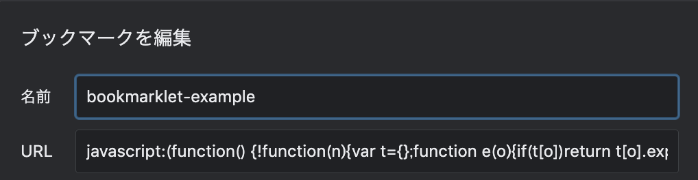
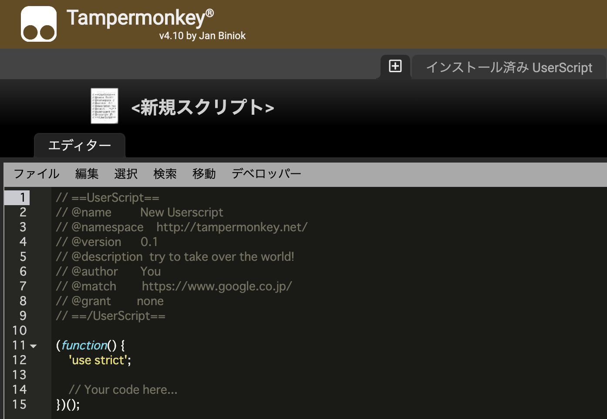

# userscripts-bookmarklets
### GitHub Pages: [url-splitter](https://github.com/quietnumeric/userscripts-bookmarklets/tree/master/distribution/bookmarklets/url-splitter)の開発用モックアップを公開中
https://quietnumeric.github.io/userscripts-bookmarklets/bookmarklets/url-splitter/
***
### 作ったユーザースクリプトやブックマークレットをシェア

[./distrubution](./distrubution)以下を利用

### [./distribution/bookmarklets](./distrubution/bookmarklets)

- ブラウザのブックマーク URL 欄に貼り付けるだけで済むソースコードを提供
  

### [./distribution/userscripts](./distrubution/userscripts)

- Tampermonky プラグイン向けに提供
  
  - 導入方法など  
    https://rightcode.co.jp/blog/information-technology/tampermonkey-google-chrome-extended-function
