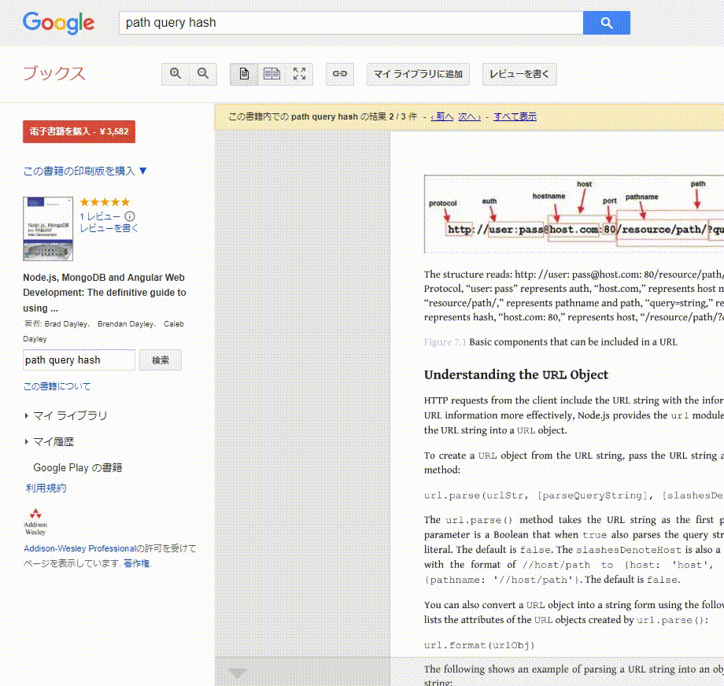

###### bookmarklets

# url-splitter
  

- URLと末尾の用途別文字列を、構成要素別に分解して表示
- 構成要素は読取専用テキストボックスに展開される
  - 1クリックコピーする事ができる
  - ドラッグ範囲選択による部分的コピーもできる
- 構成要素の分類
  - host
    - ホスト名(ポート含む)
  - path
    - ホスト名より後のURLを構成する1パスにつき1行
  - query
    - クエリー文字列を1key=valueにつき1行(keyテキストボックスとvalueテキストボックスに分離)
  - hash
    - ハッシュ文字列(#ありテキストボックスと#なしテキストボックスに分離)
- 既知の変な挙動
  - 同じ要素の1クリックコピーを実行する度に、選択ハイライトの有無がトグルされる(Chrome)
    - 実際の動作としては、毎回クリップボードに乗る
    - クリップボードに乗せるにあたって下記のうち後者の実装を採用しており、その場合は不可避な現象である模様
      - ブラウザ間差異の大きいAPI実装
      - ブラウザ標準の動作を素直にキックする実装
